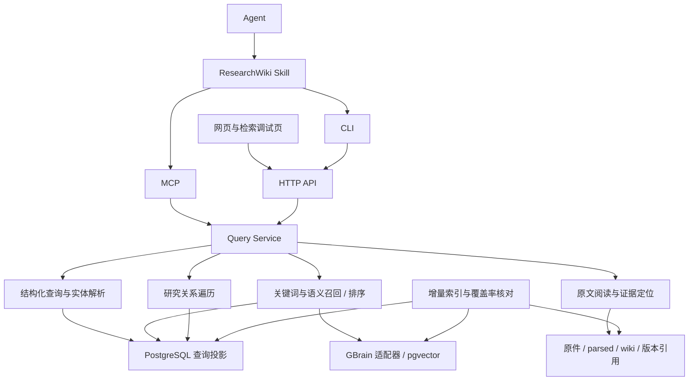

# ResearchWiki：Agent 接入与查询检索设计

日期：2026-09-13。2026-09-14 更新：首期查询、检索、阅读及六个 Agent 工具已实施，使用方式与当前能力边界见 [Agent 接入说明](agent-access.md)。下文保留总体设计，未实施的后续阶段不代表现有能力。最初调查基于 investment 分支工作区（包含尚未提交的修改）与本机 manifest 只读快照。

## 1. 目标与判断

让 Agent 能独立完成“了解库中有什么 → 定位材料 → 阅读原文 → 追踪引用与关系 → 收集足够证据”的研究过程。首期交付是可靠的查询、检索与阅读闭环，后续再加入研究成果写回。

核心决策：建设一套 ResearchWiki Query Service，由网页、CLI、MCP 共享。Skill 描述研究操作方法；CLI 和 MCP 提供同一组能力；服务层统一过滤、召回、证据定位、覆盖率与错误语义。

远程优先约束（2026-09-14 补充）：主要消费者是其他机器上的 Agent。查询与索引在服务端运行，独立的鉴权只读端口提供 HTTP、Streamable HTTP MCP 和原件下载；CLI 与 stdio 桥只依赖远程地址和读凭据，可分发轻量包。不得把本机 stdio 或 localhost 验收等同于跨机器可达。部署细节以接入说明为准。

成功标准包括：能发现尚未完成向量化的材料；能准确执行公司、时间、机构等条件；能回答“检索为什么漏掉这篇”；能把返回的证据定位到具体版本和原始位置。工具数量和生成答案的流畅程度不作为检索质量指标。

## 2. 已有基础与具体缺口

| 当前证据 | 对设计的影响 |
| --- | --- |
| `scripts/server/search-service.mjs` 提供 fast/deep、types、limit、offset，经 MCP 调用 GBrain；MCP 失败后统一调用 CLI query | 回退会改变 fast 的执行语义；需要统一执行计划、预算和降级说明 |
| `scripts/wiki.mjs` 的 search 直接调用 GBrain query | CLI 与网页未共享 ResearchWiki 的分类补充、页码映射与返回契约 |
| `scripts/mcp-stdio.mjs` 原样转发上游工具列表和调用 | 已有只读 token，但缺少 ResearchWiki 专用、稳定且紧凑的工具面 |
| `scripts/server/pages-service.mjs` 合并数据库与磁盘页面，支持分类、标签、研究阶段等筛选 | 可以复用字段语义；目前全文检索只接收 types，且库筛选用 category，存在口径差异 |
| 搜索摘要清理公式、图片并截断至 700 字符；`pdfPageForChunk` 用正文字符串匹配推断页码 | 适合结果预览；不能单独作为精确引文与表格证据接口 |
| GBrain 本地源码已有关键词、向量、RRF、可选重排、查询扩展、去重和诊断相关能力 | 优先核验、复用；源码存在不代表当前配置已启用或研究语料效果达标 |
| GBrain 的 CJK 关键词回退使用分词项 ILIKE 与词频排序 | 中文长问题、术语、公司简称必须单独评测；不能把当前关键词路径宣称为中文 BM25 |
| 已有原件、解析文件、manifest、文章字段、分析师预期及支持/反驳等关系 | 接入层应保留这些研究信息及原文出处，而非只返回标题与相似度 |

2026-09-13 的 manifest 快照：11,334 份文献；indexed 7,623、parsed 3,705、failed 6。该统计不是数据库分块、向量完整率或可检索率的实测，亦不包含所有独立研究页面。下一步必须核对 manifest、解析文件、Wiki、数据库行和向量之间的差异。

## 3. 总体架构



查询与 Agent HTTP/MCP 面运行在现有 Node 服务中；CLI 默认调用同一服务。stdio 桥接专用 Agent MCP，而非原样暴露 GBrain。GBrain MCP 可以继续作为内部适配路径，但 Query Service 的定义不依赖其工具名称。

服务不可用时 CLI 返回 SERVICE_UNAVAILABLE 和可执行的诊断建议，不偷偷切换到另一种搜索算法。离线模式作为后续显式能力，必须说明快照版本和覆盖边界。

沿用 PostgreSQL、pgvector 和现有 embedding 配置。新增项目自有的查询投影 schema，避免把全部研究字段改动散落到 vendor 补丁。若 GBrain 当前接口不能把条件下推到每个召回分支，应扩展适配器或提供项目自有 SQL 召回分支；不能先取全库前 20 条再过滤。

## 4. 材料模型与可检索覆盖

### 4.1 统一标识与来源

- `document_id`：稳定的逻辑文献 ID，复用可用的 manifest ID；独立 Wiki 页面也分配持久 ID。slug 用于导航，重命名不改变身份。
- `revision_id`：精确内容版本。派生解析版本额外记录原件哈希、解析器版本与解析内容哈希。
- `block_id`：版本内的段落、标题、表格或图注位置，持久记录父章节和原始定位。
- `chunk_id`：某一分块索引版本的检索单元，允许重建；引文最终依赖 revision/block，不能只依赖 chunk_index。
- `family_id`：同一来源的原文、译文、阅读卡和其他派生物。它们可分别命中，但检索时按需分组，不能被算作多份独立证据。
- `entity_id`：公司、行业、机构、主题等研究实体；保存名称、别名、证券代码与市场。相似名称不自动合并。

文献、研究页面与实体是不同概念。例如“公司研究报告”的 category 可以是 company，但它仍是 source 文献；不能与 company 实体页混为一类。保留 `page_type`、`research_category`、`document_type` 独立过滤字段。

投影建议包括 documents、document_revisions、blocks、entities、entity_aliases、document_entities、relations、index_state。它们是可重建的查询读模型：既有 Markdown/frontmatter、manifest 和原件仍保留其职责；不能形成两套互相覆盖的事实来源。为每类字段确定来源优先级，抽取字段记录抽取版本、证据和核验状态。

### 4.2 索引状态拆分

用独立状态描述 catalog、text、lexical、vector、metadata、relations、citation，而非一个 indexed 布尔值。每项至少含状态、当前 revision、更新时间和错误码。

| 材料状态 | 首期可用能力 |
| --- | --- |
| 仅有原件或解析失败 | 目录、已知元数据和原件访问，明确没有正文检索 |
| 已解析，未整理字段/向量化 | 目录、基础正文关键词检索、按页阅读；缺失字段显式 unknown |
| 已有结构化字段 | 精确字段查询、分面、预期数据对比 |
| 部分/全部向量已建 | 对应范围的语义召回；报告向量覆盖分母与索引版本 |
| 已更新但索引未追上 | 返回 stale，阅读按明确版本执行，避免新正文搭配旧定位 |

建立独立的基础目录和关键词索引阶段，从已有 parsed 结果构建，不要求先运行 LLM 整理或 embedding。兼容已有 parse-only 工作流；不把“开放检索”隐式变成收费模型处理任务。

索引任务使用 document/revision 幂等键、可恢复状态和发布水位。完整版本通过核验后才切换活动指针；旧引用保留可读版本，若无法保留则显式报 REVISION_UNAVAILABLE。删除和替换更新墓碑；增量事件之外定期全量核对，发现漏索引与孤儿数据。

## 5. 查询与检索设计

### 5.1 三种需求共用过滤契约

1. **结构化查询 query**：枚举、筛选、计数、分组、排序。例如某公司某月某机构的全部报告。没有自然语言相关性截断，支持稳定游标与完整性状态。
2. **相关性检索 search**：在明确范围内按问题找文档或段落。返回排名与匹配解释，不承诺全库穷尽。
3. **原文阅读 read**：按文档、版本、目录、章节、块或 PDF 页获取内容；支持文内关键词定位与相邻段落。

结构化过滤字段优先覆盖：类型/分类、公司与代码、行业/主题、机构/作者、标签、语言、发布日期、资料截至日、入库时间、研究阶段、核验状态和索引状态。采用字段白名单及 `all/any/not`、`eq/in/gte/lte/exists` 的有界表达式；不开放任意 SQL、脚本或文件路径。非法字段/操作符报错，不静默忽略。

同一公司条件应在同一个 analyst_expectations 条目内匹配该公司的评级与预测，防止多公司报告发生交叉匹配。数值比较仅用于已经完成单位、币种、期间和口径归一化的字段；原始字符串无法可靠比较时明确不支持。

严格过滤只依据已记录的字段，缺失值默认不满足条件；如选择 include_unknown，应单独返回不确定组。探索时可使用实体别名/正文提及扩大召回，但必须把“字段明确匹配”与“正文可能涉及”区分，并输出实际过滤计划。

### 5.2 时间语义

区分 published_at、data_as_of、ingested_at、updated_at。文件名日期和文件修改时间仅作为带来源标记的线索，不能充当核实发布日期。

`published_at <= D` 表示按文献出版时间筛选；它不等于“本库在 D 时已知的信息”。后者需要系统记录时间、版本历史和变更留痕；现有历史不完备时不承诺 point-in-time 查询。论文样本期、预测期和文献发布日期也分别建字段。

### 5.3 检索执行链

```text
校验请求和预算
→ 解析实体、时间、显式过滤，形成可读 query_plan
→ 在授权且满足条件的材料范围内并行召回
  · 标题/代码/别名/DOI/原文短语精确匹配
  · 正文与字段关键词匹配
  · bge-m3 语义匹配
→ 合并候选，按文档家族去重与分配段落名额
→ 排序融合；按配置对有限候选重排
→ 返回结果卡、可读取的证据 ID、覆盖率、降级与截断信息
```

保留精确通道，避免证券代码、年份、关键数值和已知标题被语义近似淹没。中文关键词先用固定评测验证现有 CJK 路径；若不足，在写入时建立带领域词典的中英混合分词投影，标题、实体、摘要、正文分字段权重。可在 PostgreSQL 中实现预分词的全文索引，但应准确称为字段加权全文检索；是否引入真正 BM25 或外部检索引擎由实测决定。

优先复用 GBrain 的 RRF 和候选排序。若外层整合项目自有召回，适配器必须区分“各通道原始候选”与“已经融合的结果”，防止重复融合和重复加权。原始相似度、RRF 排名分数与重排分数分别记录，不作为可跨查询比较的置信概率。

过滤下推到每个召回分支。向量近似索引在严格过滤下可能供给不足：动态扩大候选或对较小过滤集合做精确向量扫描，直至预算耗尽；仍不足时标记检索不完整。排序后再次校验过滤是防线，不是主要过滤方法。

默认以文档分组返回，每篇提供 1–3 个最佳段落，允许显式 passage 模式。原文、译文与阅读卡共享来源分组。优先展示可核对的原文证据；人工观点、机器抽取和摘要分别标记，不因叫 compiled_truth 就默认更可靠。

### 5.4 模式与失败行为

- `lexical`：确定性关键词和精确检索，不调用生成模型。
- `hybrid`：关键词与向量融合；默认模式，不做生成式问题改写。
- `deep`：在显式预算内启用可用的查询扩展、重排和有限关系扩展；输出改写后的子查询与实际执行项。

深度模式的生成模型和重排模型分别检查能力，不能假设共享 embedding 服务提供这些能力。超时/额度/取消贯穿整次请求；重试共享剩余预算，不层层重新计时。任何降级都记录原因和受影响范围。

空结果必须区分：筛选后库内无材料、范围内没有命中、正文/向量覆盖不足、索引落后、某通道失败。不把有限 Top-K 搜索的零结果解释成“库里不存在”。只有 query 在已知完整目录与指定快照范围内才可报告准确计数；未知字段与未登记材料的边界另行说明。

### 5.5 标签是独立查询入口（2026-09-14 补充）

用户已有大量公司代码、公司、行业、领域等标签，应作为首期精确查询索引。标签选择不依赖 embedding，也不依赖标签文本恰好出现在正文中。

当前资料库提供标签名称搜索与单标签精确筛选：`GET /api/tags` 返回标签及页面数，`GET /api/pages?tag=<完整标签>` 按完整标签匹配。资料库的 q 对标题、slug、标签、别名、research.tickers 和地区做子串筛选。全文搜索 `/api/search` 目前仅暴露 q、mode、types、limit、offset，尚未提供显式标签条件；因此搜索框输入某标签不等于按该标签筛选。

设计增加三个层次，复用前述核心工具：

1. **查标签词典**：describe 支持分页读取标签分类、标签与数量；resolve 支持标签名称、别名与代码消歧。Agent 先发现真实标签值，再构造过滤，不能凭空猜名称。
2. **按标签查材料**：query 支持 tags 的 contains_all / contains_any / contains_none，分别表示同时包含、包含任意、排除任意。与机构、日期等条件可组合；标签精确查询不要求正文或向量已索引。
3. **在标签范围内检索正文**：search 接受相同标签条件，例如先限定“领域:半导体”和已解析的公司标签，再检索“毛利率下滑原因”。标签约束下推至关键词与向量召回，返回标签命中依据。

标签投影建立 tags、tag_aliases、document_tags，保存稳定 tag_id、原始名称、分类、规范值、来源与可选 entity_id。既有手工标签原样保留；别名归一只增加映射，不直接改写历史标签。冒号前缀可以作为分类线索，但不据此推断公司身份；无前缀标签同样可用。公司代码保留市场限定和字符串形式（含前导零），裸代码有歧义时返回候选。

每个标签关联记录人工/导入/模型抽取来源及核验状态；来源无法追溯的历史标签记为 unknown。用户可选择只用人工确认标签作为硬条件，也可允许自动标签扩大范围。缺少标签不代表文献不涉及该主题：严格标签查询只保证标签集合内的完整性；跨标签探索通过显式模式另查实体和正文，不静默放宽条件。

网页使用同一契约，支持多标签选择、交集/并集/排除，显示当前条件下的标签分面数量。初始默认多选为交集，用户可显式改为并集，界面和 query_plan 均展示含义。分面统计以过滤后的完整目录集合为基准，不从搜索 Top-K 结果推算；接口说明是否排除当前分面自身条件。统计按逻辑文献去重，另行标明来源家族数量，避免译文或多个命中段落导致虚高。

这些多标签能力、标签词典 Agent 接口与全文标签过滤均属于拟议设计，尚未实现。

## 6. Agent 接口

首期注册六个面向研究的 MCP 工具，CLI 与 HTTP 使用相同请求/响应 schema。下列名称均为拟议接口，当前尚不可执行。

| MCP 工具 | CLI | 主要输出 |
| --- | --- | --- |
| `research_describe` | `rkw describe` | 可查询字段、枚举、模式能力、库版本、索引覆盖、用法示例 |
| `research_resolve` | `rkw resolve` | 标题/ID/公司/简称/代码消歧及候选，不静默猜测 |
| `research_query` | `rkw query --request file.json` | 过滤列表、字段投影、计数/分组、快照游标 |
| `research_search` | `rkw search --request file.json` | 文档/段落命中、query_plan、引用定位、通道状态 |
| `research_read` | `rkw read <id>` | 元数据、目录、章节/页/块、相邻原文、附件引用 |
| `research_related` | `rkw related <id>` | 有类型、有方向、有出处的关系与证据路径 |

CLI 同时支持常用简短参数，复杂条件通过 UTF-8 JSON 文件或 stdin 传入。stdout 仅输出版本化 JSON，日志进入 stderr；统一错误码和退出码，支持批量读取、deadline 与取消。脚本不得自行连接底层数据库复制检索逻辑。

MCP 用 inputSchema、outputSchema 和 structuredContent 描述同一契约，并为兼容客户端提供序列化文本。静态字段说明可提供 Resources，文档内容以有界 read 工具为基线，以适应不同客户端的资源读取能力。只读工具标注只读提示，实际权限由服务端校验。协议依据：[MCP Tools](https://modelcontextprotocol.io/specification/2025-11-25/server/tools)。

Skill 计划位于 `skills/research-wiki/SKILL.md`，只教授实际接口及研究流程：首次 describe；有明确对象先 resolve；枚举用 query、发现用 search；先目录后精读；引用前 read 原文；需要扩展证据时 related；空结果先检查条件和覆盖，再修改查询。服务端承担正确性约束，Skill 不复制算法，也不要求 Agent 读取私有配置。

第二期可增加 `research_collect`：把选定结果或有界子查询组成研究材料包，返回主题覆盖、证据片段、原文/派生标记、未解决问题与引用清单。它不把未经核验的自动摘要变成事实。

### 6.1 请求示例

```json
{
  "query": "资本开支增长能否转化为持续收入",
  "mode": "hybrid",
  "filters": {
    "all": [
      { "field": "entities.id", "op": "in", "value": ["company:example"] },
      { "field": "published_at", "op": "gte", "value": "2026-07-01" }
    ]
  },
  "group_by": "document_family",
  "limit": 10,
  "max_response_tokens": 6000,
  "timeout_ms": 15000,
  "explain": true
}
```

`company:example` 是占位符，真实 ID 来自 resolve。预算按明确 tokenizer 计算或返回估算方法，同时设置硬字符/字节上限；不声称适配所有模型的精确 token 数。

### 6.2 共同返回契约

响应包含 `schema_version`、`request_id`、`snapshot_id`、`query_plan`、`results`、`coverage`、`degraded`、`truncated`、`next_cursor` 与计时。coverage 同时说明全库统计、条件范围内统计和当前实际搜索范围，缺失分母用 null，不能给虚假的精确百分比。

每个命中至少包含 document/revision ID、标题、实体、分类、日期及来源、命中字段/通道、原文或派生内容标记、snippet、可读 evidence ID、索引状态。Snippet 只是预览；引用通过 read 取得精确原文。

引文含 PDF 物理页码（对外从 1 开始）、印刷页码（如已知）、章节路径、块 ID、原文片段、文档版本与打开链接。无页码的网页使用章节和块定位。映射不确定时返回 null 和定位质量，禁止猜页。表格读取保留表头、单位、脚注及必要的跨页上下文；图片可返回关联资产供具备视觉能力的 Agent 阅读，首期不承诺图像内容语义检索。

结构化 query 使用快照和稳定排序的游标。相关性 search 对一次请求物化有界候选集及顺序，游标在短期保留的搜索会话内翻页；过期显式报错。该游标表示候选集合内的后续结果，不表示完整全库结果。

## 7. 关系与研究证据

复用 `about`、`belongs_to`、`impacts`、`compares_with`、`supported_by`、`contradicted_by`、`derived_from` 等契约，支持 incoming/outgoing/both 和关系类型过滤。默认一跳；最多两跳并限制节点、边和返回预算。

每条边带来源页面/字段或证据、方向、人工/自动标记与核验状态。正文提及只能称为 mentions，不能升级为 supported_by。相关性高或观点不同不能自动证明“支持/反驳”。没有显式反方关系时，可提出新的反方问题搜索，并标注为待核验候选材料。

相同指标的预测对比保留主体、机构、报告时间、预测期、币种、单位、会计口径和来源类型。检索系统可以提供结构化记录；跨口径结论交由研究过程解释。

## 8. 检索调试与验收

在现有 SearchPage 增加调试视图，与 Agent 共用查询服务。展示解析条件、各通道候选、过滤前后数量、融合/重排位置、去重依据、索引版本、覆盖、各阶段耗时和最终原文位置。用户可指定一篇预期文档查看在哪一步丢失。

先收集约 60–100 个真实问题，并按以下类型标注目标文献和证据段落：标题/代码精确查找、中文简称、中英跨语言、时间与机构过滤、公司/行业歧义、数字表格、观点分歧、多步关系、未向量化材料、空结果和旧版本。保留独立验收集，不能用同一组问题反复调参后宣称泛化效果。

| 维度 | 指标与首期验收方式 |
| --- | --- |
| 精确定位 | 已知 ID/唯一标题/代码消歧测试正确；歧义明确返回候选 |
| 条件正确性 | 固定样本上的越界文档数为 0；枚举完整率对照目录基准，覆盖缺失字段情形 |
| 检索质量 | 文档 Recall@20、MRR/nDCG@10 与证据段落 Recall 分开计算；对比现有系统、纯关键词与混合检索 |
| 引用正确性 | 固定验收样本中原文可回读、版本与页码一致；定位失败明确暴露，误报页码为 0 |
| 覆盖与故障 | 已解析未向量化样本可被关键词找到；断开向量服务仍能检索并明确降级 |
| Agent 效率 | 完成找资料/引用任务的成功率、调用次数、返回 token 和无效重复调用 |
| 性能 | 记录冷/热 p50、p95、各阶段耗时与并发竞争；初拟 query p95 < 1 秒、lexical < 2 秒、hybrid < 5 秒，需按当前库实测校准 |

性能目标是设计预算而非实测承诺。deep 由请求 deadline 控制。语义质量的提升门槛在基线测量后确定；不预先给出没有标注支持的“准确率 95%”。对每个失败案例区分：资料没有登记、字段缺失、过滤错误、召回失败、排序失败、分块不佳、证据定位失败或工具使用错误。

诊断与评测默认本地保存，常规日志只记必要元数据，原文与完整查询的持久保存按明确配置启用。

## 9. 权限边界与后续写回

接入面首期只读，限制于当前配置的数据实例。服务端按 scope 和允许操作校验所有 read、search、query、related、资源读取；前端展示的只读标记不是授权机制。文献正文作为待研究数据返回，不参与工具授权。路径通过 ID 解析并复用现有 realpath/目录边界检查。

原有管理与导入 CLI 保留独立用途，不通过 Agent 工具清单自动暴露。第二阶段写回采用单独的 write scope、草稿操作、引用校验、幂等键和 revision 条件更新；禁止无条件覆盖已有研究结论。自动关系抽取可先保存候选关系，再按研究流程核验。

## 10. 实施顺序与交付

| 阶段 | 主要工作 | 完成条件 |
| --- | --- | --- |
| P0：基线与契约 | 核对完整材料覆盖，审计实际启用的 GBrain 能力；建立真实查询集；冻结字段、ID、版本、错误及预算契约 | 能列出“哪些材料目前不可检索、为什么”，并复现主要检索失败 |
| P1：最小研究闭环 | 基础目录与关键词投影；统一 query/search/read；实体解析、条件下推、稳定证据定位；六个只读 MCP 工具、CLI 和 Skill | 同一请求在网页/CLI/MCP 返回一致材料；已解析材料可发现；引用能回到原文 |
| P2：召回与排序优化 | 中文术语、跨语言、向量过滤、文档家族去重、可选重排、评测与调试页完善 | 在冻结验收集上较基线改进，精确条件与引用正确性不退化 |
| P3：深度研究接入 | 有界材料包、研究对象时间线、结构化预测对比、草稿写回 | 多步研究任务可追溯，自动生成内容与来源证据清楚分离 |

P1 中的关系接口可先复用已有关系表，实体解析先覆盖已有明确实体与别名；不要求先完成全库自动知识图谱。P2 模型选择与基础设施扩容只在评测表明需要时进行。

建议代码组织：`scripts/query/` 放契约与业务服务，`scripts/query/adapters/` 放 GBrain/数据库/文件适配；`scripts/agent/` 放 CLI/MCP；`scripts/index/` 放投影与核对任务；`tests/retrieval/` 放固定查询与评测；`skills/research-wiki/` 放工作流。网页现有 API 先用兼容适配层迁移，保留旧参数到新参数的明确映射，并逐步停用重复路径。

下一步建议从 P0 开始，优先回答两个问题：3,705 份 parsed 文献在目录与正文检索中各自的实际可见率是多少；用户最常用的公司、时间、机构及原文问题，在当前检索链上分别在哪里失败。
